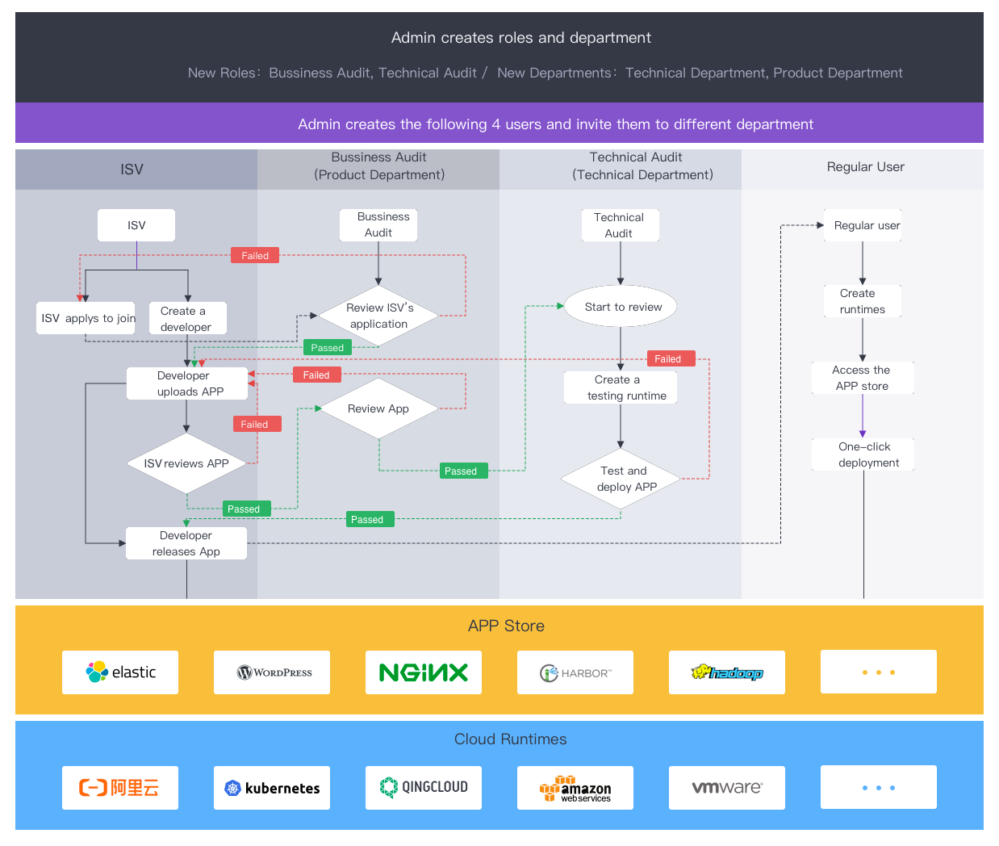
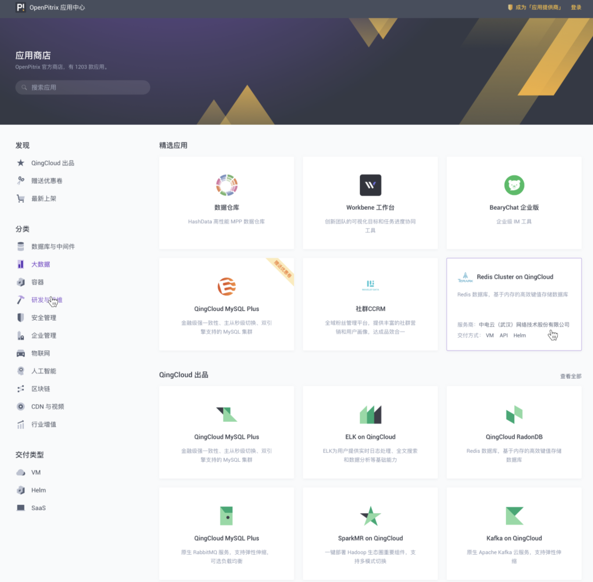

<p align="center"><a href="http://openpitrix.io" target="_blank"></a></p>

# OpenPitrix

[](https://travis-ci.org/openpitrix/openpitrix)
[](https://hub.docker.com/r/openpitrix/openpitrix/)
[](https://goreportcard.com/report/openpitrix.io/openpitrix)
[](https://godoc.org/openpitrix.io/openpitrix)
[](https://github.com/openpitrix/openpitrix/blob/master/LICENSE)

----

[OpenPitrix](https://openpitrix.io/) is an web-based open-source system to package, deploy and manage different types of applications including Kubernetes application, microservice application and serverless applications into multiple cloud environment such as AWS, Azure, Kubernetes, QingCloud, OpenStack, VMWare etc.

> Definition: Pitrix _['paitriks]_ means the matrix of PaaS and IaaS which makes it easy to develop, deploy, manage applications including PaaS on various runtime environments, i.e., Pitrix = **P**aaS + **I**aaS + Ma**trix**. It also means a matrix that contains endless (PI - the Greek letter "π") applications. 

----

## Motivation

OpenPitrix originates from [QingCloud AppCenter](https://appcenter.qingcloud.com) which helps developers to create cloud-based enterprise applications with all features of cloud application, such as agility, elasticity, scalability, monitoring and so on. ISV can sell their Apps on the application marketplace. Also, the learning curve of developing an App is extremely low. Many customers love AppCenter but raise the request that they hope it can support their multi-cloud environment instead of QingCloud exclusively, so OpenPitrix was born in this scenario, see [OpenPitrix Insight](https://github.com/openpitrix/openpitrix/wiki/OpenPitrix-Insight) for more details.

## Features

- **Multi-cloud:** Support multiple runtimes, such as AWS, Aliyun, Azure, Kubernetes, QingCloud, OpenStack, VMWare and so on. 
- **Multiple Apps types:** Support a variaty of application types including VM-based application, Kubernetes application, microservice application and serverless application.
- **Application Lifecycle Management:** Developers can easily create and package applications, make flexible application versioning and publishing, others can check, test and quick deploy applications through the application marketplace.
- **Extendable and Pluggable:** The types of runtime and application are hightly extendable and pluggable, regardless of what new application type or runtime emerges.
- **RBAC for organization:** Provide multiple roles including regular user, ISV, developers and admin, admin can also create custom roles and department.
- **Commercial Operation (Coming soon):** Provide cloud metering and billing for application marketplace, ISV can sell and operate published applications.

> Note: 
> - See the [Screenshots](docs/op-screenshot.md) of OpenPitrix to have a most intuitive understanding of OpenPitrix dashboard.
> - See this [document](https://openpitrix.io/docs/v0.4/zh-CN/introduction/basic) that elaborates on the OpenPitrix features and introduction from a professional point of view.

## Workflow

The following flow chart illustrates the application lifecycle management process and workflow with different role of users, see the [Quick Start Guide](https://openpitrix.io/docs/v0.4/zh-CN/getting-start/introduction) for more details.

> Tip: Please browse from top to bottom.



## Latest Release

OpenPitrix v0.4 was released on April 1st, 2019. See the [Release v0.4.0](https://github.com/openpitrix/openpitrix/releases/tag/v0.4.0) to preview the updates and bugfix.

## Installation

### Minimum Requirements

- Operating Systems: Any OS.
- Hardware
   - CPU：1 Core
   - Memory：1 G
   - Disk Space：10 G
- Software
   - [Docker](https://docs.docker.com/install/): 18.03.0-ce (Minimum version)
   - [Docker-Compose](https://docs.docker.com/compose/install/): 1.21.0 (Minimum version)
   - [Make](https://www.gnu.org/software/make/): 3.81

### All-in-One

[All-in-One](https://openpitrix.io/install): For those who are new to OpenPitrix and looking for the fastest way to install and experience the dashboard. Execute following commands to download and install OpenPitrix in a single node. 

```bash
$ wget https://github.com/openpitrix/openpitrix/releases/download/v0.4.1/openpitrix-v0.4.1-docker-compose.tar.gz && tar -zxf openpitrix-v0.4.1-docker-compose.tar.gz
$ cd openpitrix-v0.4.1-docker-compose/
$ make
```


Normally, all of the images pulling and containers will be completed in a few minutes, then you can use `http://<NodeIP>:8000` to preview the dashboard, the default admin account is `admin@op.com	/ passw0rd`

### Deploy on Kubernetes

All-in-One is only used to deploy OpenPitrix for testing and previewing. In a formal environment, the installer supports you to deploy OpenPitrix on Kubernetes cluster, see [Helm Chart Installation](https://openpitrix.io/docs/v0.4/zh-CN/installation/helm-chart) and [Install on Kubernetes](https://openpitrix.io/docs/v0.4/zh-CN/installation/kubernetes) for more details.

## To start using OpenPitrix

### Quick Start

The [Quick Start Guide](https://openpitrix.io/docs/v0.4/zh-CN/getting-start/introduction) provides 5 quick-start tutorials to walk you through the workflow and common manipulation with different role of users, with a quick overview of the core features of OpenPitrix that helps you to get familiar with it.

**Application Store**



## To start developing OpenPitrix

The [development guide](docs/development-guide.md) hosts all information about building OpenPitrix from source, git workflow, how to contribute code and how to test.

## Roadmap

The [Roadmap](docs/Roadmap.md) demonstrates a list of open source product development plans and features being split by the edition and role modules, as well as OpenPitrix community's anticipation. Obviously, it details the future's direction of OpenPitrix, but may change over time. We hope that can help you to get familiar with the project plans and vision through the Roadmap. Of course, if you have any better ideas, welcome to [Issues](https://github.com/openpitrix/openpitrix/issues).

## API Reference

OpenPitrix provides RESTFul API and detailed API documentations for developers, see [OpenPitrix API Reference](https://openpitrix.io/api) for more information.

## Support, Discussion, and Community

If you need any help with OpenPitrix, please join us at [Slack channel](http://openpitrix.slack.com/).

Please submit any OpenPitrix bugs, issues, and feature requests to [OpenPitrix GitHub Issue](https://github.com/openpitrix/openpitrix/issues).


## Contributing to the project

All [members](docs/members.md) of the OpenPitrix community must abide by the [CNCF Code of Conduct](https://github.com/cncf/foundation/blob/master/code-of-conduct.md). Only by respecting each other can we develop a productive, collaborative community.

You can check out [OpenPitrix Contribution Guide](https://openpitrix.io/docs/v0.4/zh-CN/contribution/contribution-guide) for the details.


