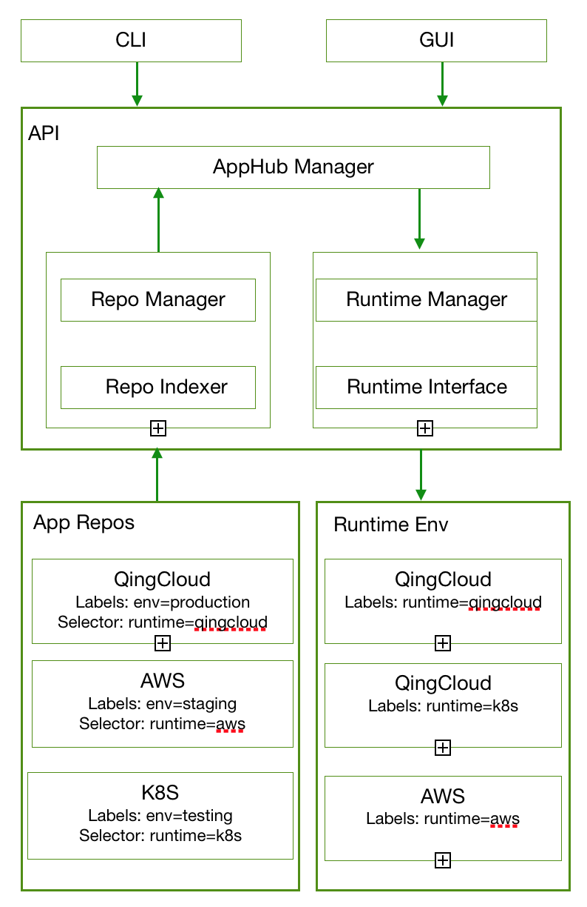

# AppHub

AppHub is an open platform to package and deploy applications into multiple environment such as QingCloud, AWS, Kubernetes etc. 

### Motivation

The project originates from [QingCloud AppCenter](https://appcenter.qingcloud.com) which helps developers to create a cloud-based enterprise application in a few days and sell it on the center. In addition, the learning curve of how to [develop such application](https://appcenter-docs.qingcloud.com/developer-guide/) is extremely low. Usually it takes a couple of hours for a developer to understand the working flow. Since QingCloud AppCenter was launched, many customers and partners have been asking us if it supports IaaS other than QingCloud such as AWS, Vmware. That is where the project comes from. 

### Design

Basic idea is to decouple application repository and runtime environment. The runtime environment an application can run is by matching the labels of runtime environment and the selector of the repository where the application is from. 

##### Design key points:
* Application repos are labelled for GUI to show in category list, and have label selector to choose which runtime to run when user to deploy any application that belongs to the repo. 
* Runtime env is labelled. A runtime can have multiple labels.
* Repo indexer will scan configured repo list periodically and cache the metadata of the repos.
* Runtime interface will provide generic interface for application management such as create cluster etc. The specific runtime will implement the interface as a plugin.

