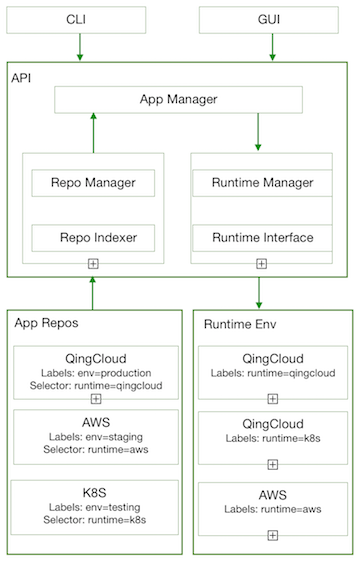

# Architecture

Basic idea is to decouple application repository and runtime environment. The runtime environment an application can run is by matching the labels of runtime environment and the selector of the repository where the application is from.

## Design key points:

* Application repos are labelled for GUI to show in category list, and have label selector to choose which runtime to run when user deploys any application that belongs to the repo. 
* Runtime env is labelled. A runtime can have multiple labels.
* Repo indexer will scan configured repo list periodically and cache the metadata of the repos.
* Repo manager is responsible for creating/deleting/updating repos.
* Cluster manager is responsible for managing the lifecyle of an application instance (actually it is a cluster) including creating a cluster, stopping a cluster, etc. It will also watch the job execution status. 
* Runtime interface will provide generic interface for application cluster management such as creating a cluster etc. The specific runtime will implement the interface as a plugin. It is part of cluster manager. For example, when creating a cluster, it will call runtime interface for the job which invokes the correponding runtime plugin such as QingCloud IaaS or AWS IaaS or Kubernetes to finish the real job.
* Runtime manager is responsibe for creating/deleting/updating runtime environment.

     

## Database

The project is microservice architecure oriented. The database design is different than monolithic approach. Please check the [design details](db-design.md).

